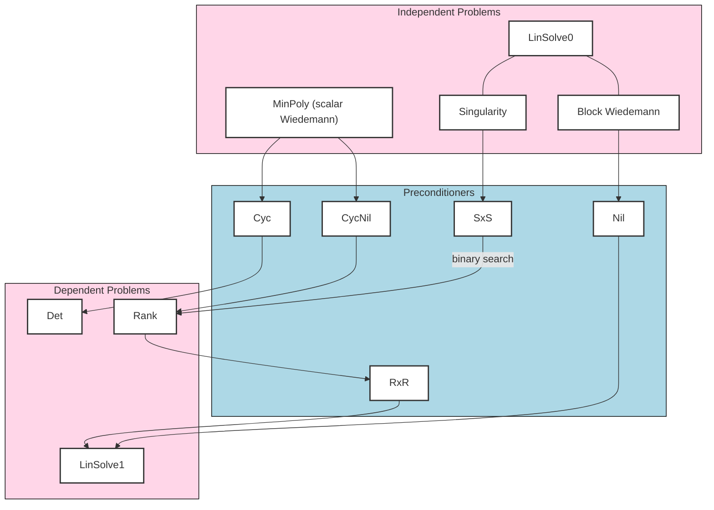

```mermaid
graph TD
  style Column1 fill:#ffd6e8,stroke:#000,stroke-width:1px
  style Column3 fill:#ffd6e8,stroke:#000,stroke-width:1px
  style Column2 fill:#add8e6,stroke:#000,stroke-width:1px
  
  %% Subgraph Column 1 (pink)
  subgraph Column1["Independent Problems"]
    direction TB
    MinPoly["MinPoly (scalar Wiedemann)"]
    LinSolve0["LinSolve0"]
    Singularity["Singularity"]
    BlockWiedemann["Block Wiedemann"]

    style MinPoly fill:#fff,stroke:#333,stroke-width:2px
    style LinSolve0 fill:#fff,stroke:#333,stroke-width:2px
    style Singularity fill:#fff,stroke:#333,stroke-width:2px
    style BlockWiedemann fill:#fff,stroke:#333,stroke-width:2px
  end

  %% Subgraph Column 2 (blue)
  subgraph Column2["Preconditioners"]
    direction TB
    RxR["RxR"]
    SxS["SxS"]
    Nil["Nil"]
    Cyc["Cyc"]
    CycNil["CycNil"]

    style RxR fill:#fff,stroke:#333,stroke-width:2px
    style SxS fill:#fff,stroke:#333,stroke-width:2px
    style Nil fill:#fff,stroke:#333,stroke-width:2px
    style Cyc fill:#fff,stroke:#333,stroke-width:2px
    style CycNil fill:#fff,stroke:#333,stroke-width:2px
  end

  %% Subgraph Column 3 (pink)
  subgraph Column3["Dependent Problems"]
    direction TB
    LinSolve1["LinSolve1"]
    Rank["Rank"]
    Det["Det"]

    style LinSolve1 fill:#fff,stroke:#333,stroke-width:2px
    style Rank fill:#fff,stroke:#333,stroke-width:2px
    style Det fill:#fff,stroke:#333,stroke-width:2px
  end

  %% Invisible edges to force vertical placement under LinSolve0
  LinSolve0 --- Singularity
  LinSolve0 --- BlockWiedemann

  %% Connections across columns
  MinPoly --> Cyc
  Cyc --> Det

  BlockWiedemann --> Nil
  Nil --> LinSolve1

  Rank --> RxR
  RxR --> LinSolve1

  Singularity --> SxS
  SxS -- "binary search" --> Rank

  MinPoly --> CycNil
  CycNil --> Rank

```
