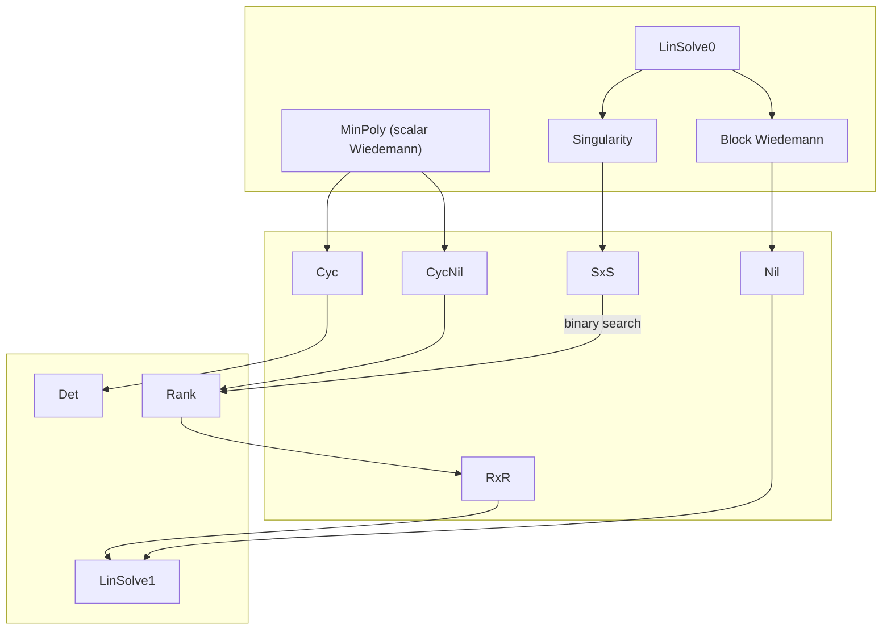

```mermaid
graph TD
  %% Subgraph Column 1 (pink)
  subgraph Column1[" "]
    direction TB
    MinPoly["MinPoly (scalar Wiedemann)"]
    LinSolve0["LinSolve0"]
    Singularity["Singularity"]
    BlockWiedemann["Block Wiedemann"]

    LinSolve0 --> Singularity
    LinSolve0 --> BlockWiedemann
  end

  %% Subgraph Column 2 (blue)
  subgraph Column2[" "]
    direction TB
    RxR["RxR"]
    SxS["SxS"]
    Nil["Nil"]
    Cyc["Cyc"]
    CycNil["CycNil"]
  end

  %% Subgraph Column 3 (pink)
  subgraph Column3[" "]
    direction TB
    LinSolve1["LinSolve1"]
    Rank["Rank"]
    Det["Det"]
  end

  %% Connections across columns
  MinPoly --> Cyc
  Cyc --> Det

  BlockWiedemann --> Nil
  Nil --> LinSolve1

  Rank --> RxR
  RxR --> LinSolve1

  Singularity --> SxS
  SxS -- "binary search" --> Rank

  MinPoly --> CycNil
  CycNil --> Rank
```